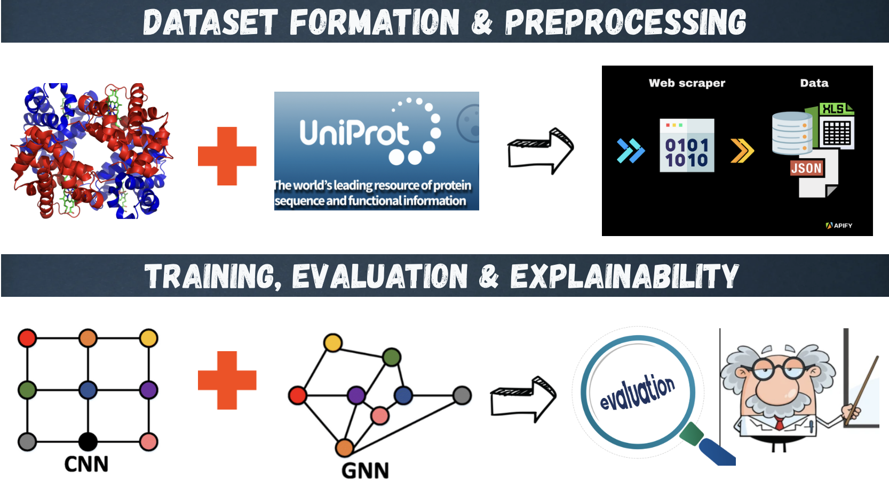

# 🧬 Protein Function Prediction with Explainable AI

**Author**: Swathy Ragupathy  
**Affiliation**: Rochester Institute of Technology (RIT)  
**Email**: swathyragupathy@gmail.com 
**LinkedIn**: https://www.linkedin.com/in/swathyragupathy/


**Date**: April 2025  

---

## Framework

<p align="center">
  
</p>

**Figure**: A schematic overview of the proposed hybrid pipeline. Protein structures (.pdb) are converted into graphs and voxel grids. A GNN processes residue-level graphs and a 3D CNN processes spatial grids. Their outputs are fused for multi-label GO term prediction, with Explainable AI tools like GNNExplainer and Grad-CAM integrated for interpretability.

## Code Structure Overview

```bash
project_name/
├── data/          # Contains raw and processed datasets (e.g., .pt files, label CSVs)
├── scripts/       # Includes data preprocessing, model training, and XAI modules
├── models/        # Stores trained model checkpoints (GNN, CNN, Hybrid), requirements.txt
├── notebooks/     # Jupyter notebooks for experiments and analysis
├── results/       # Contains logs, evaluation metrics, predictions
├── figures/       # Visualizations (e.g., architecture diagrams, Grad-CAM outputs, result graphs)
└── README.md      # Project overview and usage documentation
```
## 👾 Installation and Environment

This project requires Python 3.9+ and was developed using PyTorch and PyTorch Geometric.

### 1. Clone the Repository  
```bash
git clone https://github.com/yourusername/protein-function-prediction-xai.git  
cd protein-function-prediction-xai
```
### 2. Create and Activate the Conda Environment
```bash
conda create -n protein-xai python=3.10 -y  
conda activate protein-xai
```
### 3. Install Dependencies
```bash
pip install -r requirements.txt
```

## 🔄 Usage: Training and Testing

### Input

- A `.pdb` file representing a protein structure.
- The file is converted to:
  - `graph.pt` – Residue-level graph using spatial proximity.
  - `voxel.pt` – 3D voxel grid representing spatial density.

### Step 1: Process PDB files
```bash
python process_10percent.py
```

### Step 2: Train, Test & Evaluate the model (from Jupyter)
```bash
notebooks/main.ipynb
```

## 📊 Results and Visualizations

The performance of the proposed Hybrid GNN+CNN model was benchmarked against GNN-only and CNN-only baselines using the top 100 GO terms.

### 🔍 Evaluation Metrics:
- **Micro F1-score**
- **AUROC (macro)**
- **Hamming Loss**
- **Average Precision**


<p align="center">
  
   
</p>

## 📔 Model Card

- **Model Name**: HybridGNN-CNN for Protein Function Prediction  
- **Architecture**: Graph Neural Network + 3D Convolutional Neural Network  
- **Input**: Residue-level graphs, 3D voxel grids  
- **Output**: Probabilities over top 100 Gene Ontology (GO) terms  
- **Training Dataset**: 15% of AlphaFold MANE human protein dataset  
- **Use Case**: Predicting molecular function of proteins from structure  
- **Explainability**: GNNExplainer + Grad-CAM used for interpretability  
- **Ethical Considerations**: Model is for academic/biomedical research, not diagnostic use  

## ⚠️ Limitations & Challenges

- **Limited Data**: Only 15% of the dataset was used due to time and computational constraints, which may limit the generalization of the model.
- **High Processing Time**: Converting .pdb structures into graph and voxel formats was computationally expensive and time-intensive.
- **Label Imbalance**: The dataset had a skewed distribution of GO terms, making it difficult to predict rare functions accurately.
- **Explainability Challenge**: While Explainable AI was integrated, interpreting insights from the hybrid GNN-CNN architecture remained complex.

## 📚 Citation

If you use this repository or find the framework helpful for your research, please consider citing the following works:

1. **The UniProt Consortium** (2023). *UniProt: the universal protein knowledgebase in 2023*. Nucleic Acids Research, 51(D1), D523–D531. [https://doi.org/10.1093/nar/gkac1052](https://doi.org/10.1093/nar/gkac1052)

2. **Varadi, M.**, et al. (2024). *AlphaFold Protein Structure Database in 2024: providing structure coverage for over 214 million protein sequences*. *Nucleic Acids Research*.


## 📝 License

This project is licensed under the MIT License.

